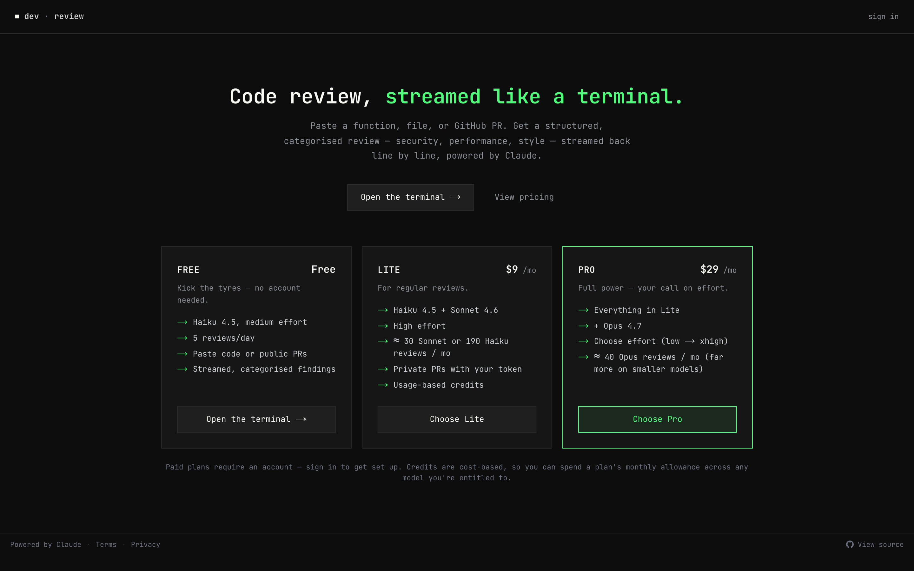

# DevReview

An AI code review tool that streams structured, categorised feedback on a pasted snippet or a GitHub pull request, powered by Claude.

**Live demo →** https://dev-review-alpha.vercel.app/



## Features

- **Streaming reviews over Server-Sent Events.** The `/api/review` route opens an SSE stream and emits typed frames (`status`, `chunk`, `error`, `done`) so findings render line by line as Claude produces them, with client cancellation forwarded straight through to the Anthropic call via an `AbortController`.
- **Structured findings via tool use, not prose.** Claude is forced to call `report_finding` / `report_summary` tools, and the server decodes each `input_json_delta` block into a normalised chunk — every finding arrives categorised as security, performance, style, or a positive callout, with optional file and line references.
- **GitHub PR review.** Paste a `github.com/owner/repo/pull/N` URL and the app fetches the unified diff (`application/vnd.github.diff`), splits it per file, and budgets large PRs by byte size before sending it to the model. Public PRs need no token; for private repos a user-supplied token is used only to fetch that diff and is never stored, logged, or forwarded to the model.
- **Tiered access with cost-aware credits.** Free, Lite, and Pro tiers gate which models and effort levels you can use; because cost varies by model and effort, each review deducts credits equal to its estimated cost and reconciles against the real token usage the API reports.
- **Rate limiting and spend control.** Per-IP and per-user minute limits plus a global daily cap are enforced through Upstash Redis (with a dev-only in-memory fallback), keeping spend under the configured Anthropic Console limit.
- **Auth and billing.** Auth.js v5 (Google + GitHub OAuth) with database-backed sessions on Neon Postgres via the Drizzle adapter, and Stripe subscriptions driving the effective tier through a webhook.

## Tech stack

Next.js 16 (App Router) · React 19 · TypeScript · Tailwind CSS v4 · Anthropic Claude SDK · Server-Sent Events · Auth.js v5 · Drizzle ORM · Neon Postgres · Upstash Redis · Stripe · Biome · Vercel

## Running locally

```bash
git clone https://github.com/shaandre96/dev-review.git
cd dev-review
npm install

# Only ANTHROPIC_API_KEY is required to run a review locally.
cp .env.example .env.local
# Then fill in:
#   ANTHROPIC_API_KEY        — required; get one at https://console.anthropic.com/
# Optional, only for the full signed-in / billing experience:
#   DATABASE_URL                              — Neon Postgres connection string
#   AUTH_SECRET                               — session signing secret (npx auth secret)
#   AUTH_GITHUB_ID / AUTH_GITHUB_SECRET       — GitHub OAuth app
#   AUTH_GOOGLE_ID / AUTH_GOOGLE_SECRET       — Google OAuth client
#   UPSTASH_REDIS_REST_URL / UPSTASH_REDIS_REST_TOKEN — rate limiting
#   STRIPE_SECRET_KEY / STRIPE_PRICE_LITE / STRIPE_PRICE_PRO / STRIPE_WEBHOOK_SECRET — billing

npm run dev
```

## Notes

A portfolio project built to demonstrate production-grade Claude API integration — SSE streaming, forced tool use for structured output, prompt-cache-friendly prompt design, and cost-aware metering — wrapped in a real auth, database, and Stripe billing stack. With just an Anthropic key set you can run reviews end to end; the auth, database, Redis, and Stripe variables only unlock the signed-in tiers and billing.

## Licence

MIT — see [LICENSE.md](./LICENSE.md).
